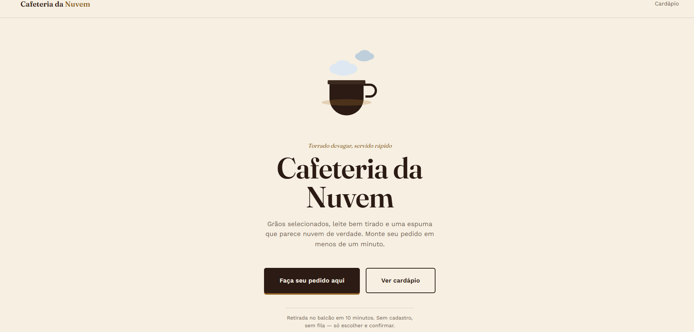
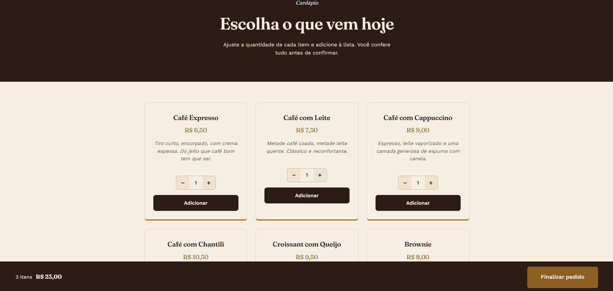
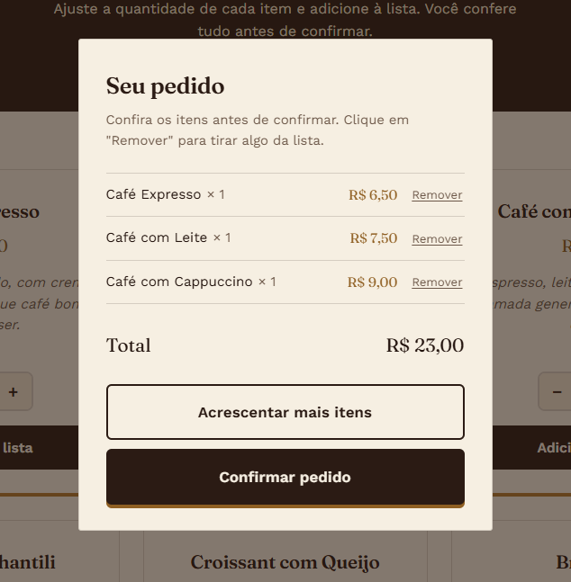
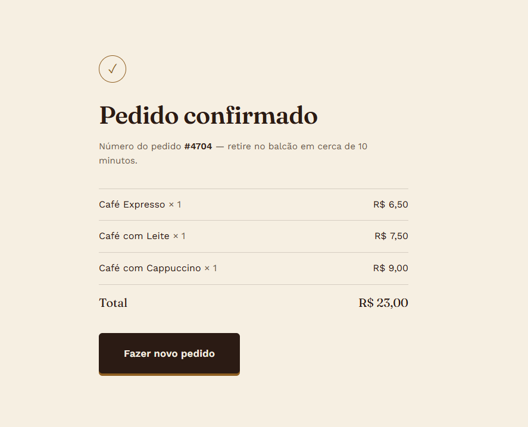

☕ Cafeteria da Nuvem

Projeto de uma página web para uma cafeteria fictícia chamada Cafeteria da Nuvem.

A proposta é criar uma experiência simples e agradável para o cliente conhecer a cafeteria, visualizar o cardápio e montar seu pedido.

🖥️ Páginas

🏠 Home

Página inicial com apresentação da cafeteria e acesso ao cardápio.

📋 Cardápio

Página de cardápio com produtos, preços, descrição dos itens, controle de quantidade e opção de adicionar produtos ao pedido. 

📋 Poup-up

confirmação de produtos, com os preços unitarios de cada item e o preço total de todos os itens. tambem é possivel remover algum item que voce queira.

📋 Confirmação 
Pagina de confirmação, onde mostra todos os itens que foram adiciado a lista, com o Numero do seu pedido com valor unitario e total. 

